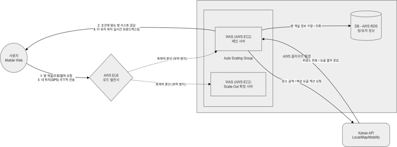

# 🚖 Taxi Mate - 대학생을 위한 택시 동승 매칭 서비스 🚖

# A. 프로젝트 명

**Taxi Mate**

* AWS 트래픽 분산 처리를 활용한 대학생 맞춤형 택시 동승 매칭 및 실시간 위치 공유 웹 서비스
  
---

# B. 프로젝트 멤버 및 역할

| 이름  | 담당                 |
| --- | ----------------      |
| 강무진 | Backend 개발         |
| 잔부부 | AWS Cloud 인프라 구축 |
| 김민경 | Frontend 개발 |

### 202155502 강무진 - (Backend)

* FastAPI 서버 구축
* REST API 구현
* 사용자 인증 처리
* 방 생성/참여 로직 구현
* Redis 연동

### 202255635 잔부부 - (Cloud)

* AWS 배포 환경 구축
* EC2 서버 운영
* Application Load Balancer 구성
* CloudFront 및 S3 구성
* Auto Scaling 및 RDS 구성

### 202325195 김민경 -  (Frontend)

* React 기반 UI 개발
* 카카오 로그인 연동
* 카카오맵 API 연동
* 방 생성 및 참여 기능 구현
* WebSocket 기반 실시간 위치 공유 구현

---

# C. 프로젝트 소개

Taxi Mate는 같은 목적지로 이동하는 대학생들을 서로 매칭하여 택시를 함께 이용할 수 있도록 돕는 실시간 택시 동승 매칭 서비스이다.

사용자는 출발지, 목적지, 출발 시간을 기준으로 동승 방을 생성하거나 참여할 수 있으며 카카오맵 기반 실시간 위치 공유를 통해 쉽게 합류할 수 있다.

또한 AWS 기반 클라우드 환경을 구축하여 사용자 증가 상황에서도 안정적인 서비스를 제공할 수 있도록 설계하였다.

---

# D. 프로젝트 필요성

대학생들은 심야 시간이나 장거리 이동 시 높은 택시 요금으로 인해 경제적 부담을 느끼는 경우가 많다.

기존에는 에브리타임과 같은 커뮤니티 게시판을 통해 동승자를 모집하였지만 다음과 같은 한계가 존재하였다.

* 게시글이 빠르게 묻힘
* 실시간 소통이 어려움
* 약속 장소에서 서로를 찾기 어려움
* 특정 이벤트 시(축제, 시험기간 심야 시간대 등) 서버 과부하 발생 가능

Taxi Mate는 이러한 문제를 해결하기 위해 개발되었다.

---

# E. 관련 기술 조사

## 1. 반반택시

반반택시는 동성 간 합승 서비스를 제공하는 대표적인 택시 동승 플랫폼이다.

### 참고한 점

* 동성 매칭 정책 --> 동성 간 합승 기능을 기획하였으나 카카오 API 정책상 성별 정보 수집에 별도 심사가 필요하여 현재 버전에서는 제외함
* 택시비 분담 구조
* 사용자 인증 방식

### 차별점

Taxi Mate는 대학생을 대상으로 하는 서비스이며 카카오맵을 이용한 실시간 위치 공유 기능을 제공한다.

---

## 2. 에브리타임

대학생 커뮤니티 서비스로 택시 동승자를 구하는 게시글이 자주 올라온다.

### 문제점

* 단순 게시판 기반
* 실시간 위치 공유 불가
* 동승자 탐색 비효율

### 차별점

Taxi Mate는 방 생성 및 참여 기능과 실시간 위치 공유 기능을 제공한다.

---

# F. 프로젝트 개발 결과물

## 주요 기능

### 카카오 로그인

* 카카오 계정 기반 로그인

### 방 생성

* 출발지
* 목적지
* 출발 시간

입력 후 방 생성 가능

### 방 참여

* 생성된 방 목록 조회
* 조건에 맞는 방 참여

### 실시간 위치 공유

* WebSocket 사용
* GPS 위치 전송
* Kakao Map 마커 표시

### 정산 기능

* 요금 1/N 계산
* 운행 종료 후 정산 안내

---

## 시스템 구성도

---

# G. 사용 방법

## 1. 로그인

카카오 로그인을 통해 서비스에 접속한다.

## 2. 방 생성

* 출발지 입력
* 목적지 입력
* 출발 시간 입력

후 방을 생성한다.

## 3. 방 참여

원하는 방을 선택하여 참여한다.

## 4. 실시간 위치 공유

참여자들의 위치가 지도에 실시간으로 표시된다.

## 5. 운행 종료 및 정산

운행 종료 후 요금을 인원수에 따라 분배한다.

---

# H. 활용 방안

* 대학생 택시비 절감
* 심야 귀가 편의성 향상
* 축제 및 시험기간 이동 지원
* 실시간 위치 공유를 통한 안전한 합류
* 향후 지역 커뮤니티 기반 카풀 서비스로 확장 가능

---

# I. AI 활용

본 프로젝트는 ChatGPT(OpenAI)와 Google Gemini를 활용하여 개발을 진행하였다.

### AI 활용 내용

* React 컴포넌트 개발 보조
* FastAPI API 개발 보조
* WebSocket 로직 구현 보조
* Redis 연동 보조
* Git 및 AWS 배포 문제 해결
* README 및 발표 자료 작성 보조

### AI 활용 비율

프로젝트 전체 코드 기준 약 30~35% 정도를 AI의 도움을 받아 작성하고 오류를 수정하였다.

최종 설계, 기능 구현, 테스트는 팀원들이 직접 수행하였다.
