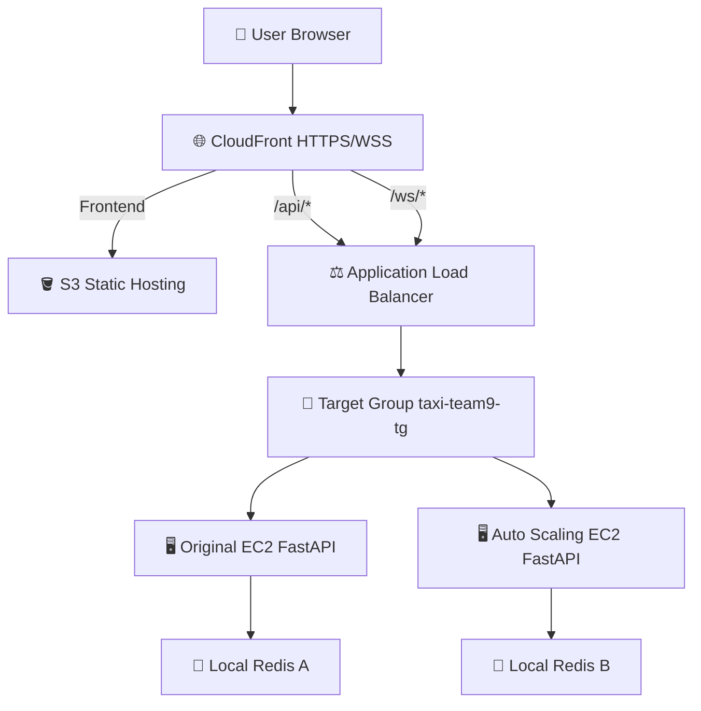
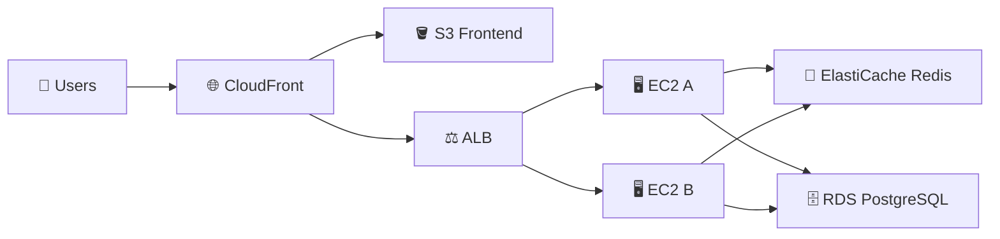
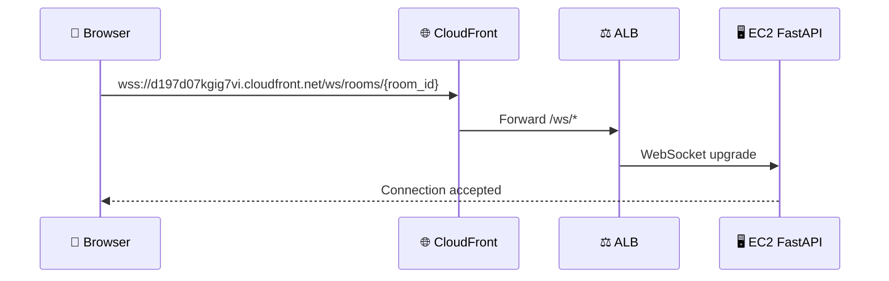
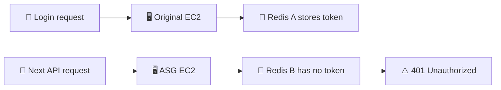
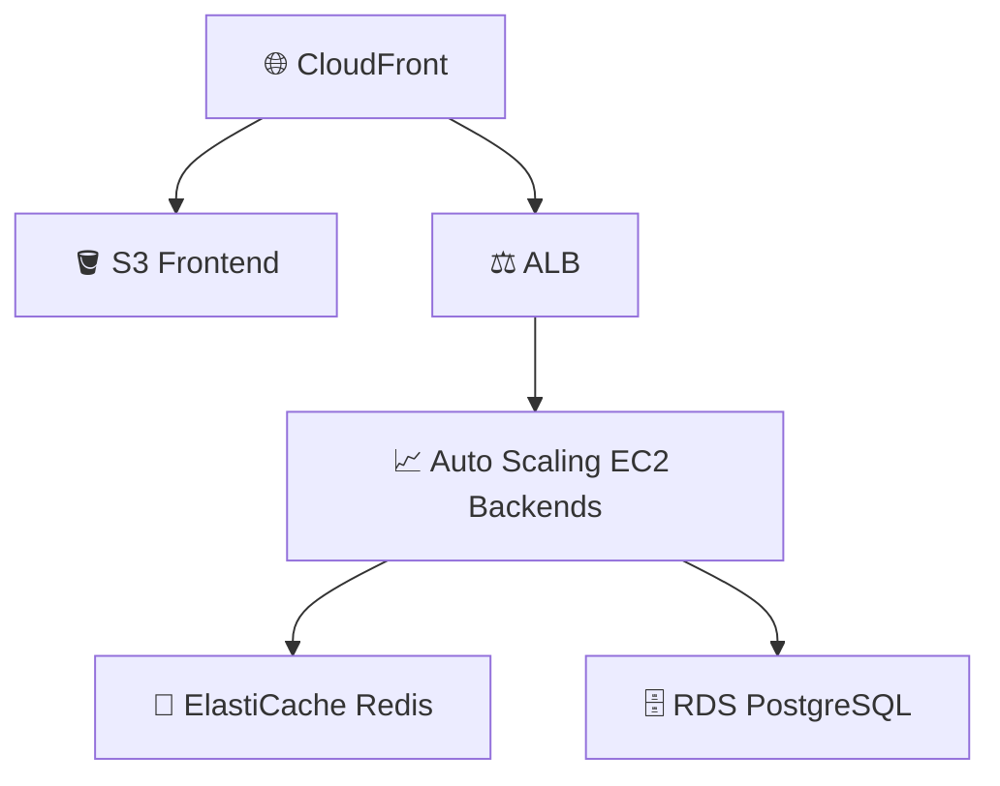

# 🚕 Taxi Team9 AWS Deployment Progress Report

This report records the final AWS deployment progress for the Taxi Mate cloud part.
It reflects the latest team branch note from `20260606_1519.md`.

---

## 🇰🇷 Korean Summary

현재 AWS 배포는 주요 데모 흐름 기준으로 동작하고 있습니다.
프론트엔드는 CloudFront HTTPS 주소에서 제공되고, `/api/*` 요청은 CloudFront를 통해 ALB로 전달된 뒤 EC2 FastAPI backend로 연결됩니다.
WebSocket 요청도 `/ws/*` CloudFront behavior를 통해 ALB와 EC2 backend까지 도달하는 것이 확인되었습니다.
Redis는 현재 EC2 내부에서 local service로 실행 중이며, Redis 미실행으로 발생했던 Kakao login 실패 문제는 해결되었습니다.
Auto Scaling Group도 생성되어 ALB target group과 연결되었습니다.

팀 변경사항(`20260606_1519.md`) 기준으로 backend에는 `/health` endpoint가 추가/확인되었고, Kakao gender review 지연 문제를 피하기 위해 성별 제한 로직은 제거되었습니다.
Frontend에는 `.map()` crash 방지, Linux import path 대소문자 수정, 방 생성 빈칸 validation이 반영되었습니다.

---

## 🧭 Current AWS Resources

| Resource | Value |
| --- | --- |
| 🌐 CloudFront | `https://d197d07kgig7vi.cloudfront.net` |
| 🪣 S3 bucket | `taxi-team9-frontend-s3` |
| ⚖️ ALB | `taxi-team9-alb-2054411194.ap-northeast-2.elb.amazonaws.com` |
| 🖥️ EC2 instance | `taxi-team9-ec2` |
| 🔑 Public IP | `13.124.236.48` |
| 🎯 Target group | `taxi-team9-tg` |
| 📈 Auto Scaling Group | `taxi-team9-asg` |
| 🚀 Launch template | `taxi-team9-launch-template1` |
| 🧠 Redis | Local Redis on EC2, `127.0.0.1:6379` |

---

## 🏗️ Architecture Overview



### ⭐ Target Production Architecture



---

## ✅ 1. Problems Fixed

### 1.1 SSH Access Problem

Initial SSH access failed:

```text
ssh: connect to host 13.124.236.48 port 22: Connection timed out
```

Cause:

The EC2 Security Group allowed SSH only from an old IP address.

Fix:

The inbound SSH rule was updated to allow the current administrator IP.

Important EC2 Security Group rules:

| Port | Source | Purpose |
| ---: | --- | --- |
| 22 | Administrator IP only | SSH access |
| 8000 | ALB Security Group | FastAPI backend traffic |

---

### 1.2 Backend Health Check Problem

ALB health check required `/health`.

Backend route:

```python
@app.get("/health")
def health():
    return {"status": "ok"}
```

Verification:

```bash
curl http://127.0.0.1:8000/health
curl http://taxi-team9-alb-2054411194.ap-northeast-2.elb.amazonaws.com/health
```

Expected:

```json
{"status":"ok"}
```

Result:

The ALB target group became healthy.

---

### 1.3 Kakao Login Failure

Kakao login initially failed with server login failure.

Backend log:

```text
redis.exceptions.ConnectionError: Error 111 connecting to localhost:6379
```

Reason:

The backend stores login session tokens in Redis, but Redis was not running.

```python
await redis_client.setex(f"session:{session_token}", 43200, kakao_id)
```

Fix:

```bash
sudo apt install redis-server -y
sudo systemctl enable redis-server
sudo systemctl start redis-server
redis-cli ping
```

Expected:

```text
PONG
```

Result:

After Redis started, Kakao login worked successfully.

---

### 1.4 Mixed Content Problem

CloudFront served the frontend over HTTPS, but the frontend tried to call the HTTP ALB directly:

```text
https://d197d07kgig7vi.cloudfront.net
-> http://taxi-team9-alb-2054411194.ap-northeast-2.elb.amazonaws.com/api/rooms
```

Browser blocked the request as Mixed Content.

Fix:

CloudFront was configured with an ALB origin and behavior:

```text
/api/* -> taxi-team9-alb-origin
```

Frontend production environment:

```env
VITE_API_BASE_URL=https://d197d07kgig7vi.cloudfront.net
VITE_WS_BASE_URL=wss://d197d07kgig7vi.cloudfront.net
VITE_KAKAO_MAP_KEY=c4648d358cb7259b86ffaae9a0b8e7b3
```

Verification:

```bash
grep -R "http://taxi-team9-alb" -n dist || echo "old ALB removed"
```

---

### 1.5 Frontend Runtime Problems

Team branch note `20260606_1519.md` records these fixes:

| File | Fix |
| --- | --- |
| `frontend/src/pages/Mainpage.jsx` | Use `data.rooms || []` to prevent `.map()` crash |
| `frontend/src/pages/Mainpage.jsx` | Match `KakaoMap` import casing to Linux filename |
| `frontend/src/pages/RoomPage.jsx` | Match `KakaoMap` import casing to Linux filename |
| `frontend/src/router/Router.jsx` | Match `Mainpage` import casing to Linux filename |
| `frontend/src/pages/CreateRoomPage.jsx` | Add validation to block empty departure, destination, or time |

These changes reduce AWS/Linux deployment errors caused by case-sensitive paths and missing API response data.

---

### 1.6 Backend Gender Logic Problem

Kakao gender consent/review was delayed.
To avoid blocking the demo, gender restriction logic was hard-disabled in the backend.

Team branch note records:

* `User.gender` removed
* `Room.gender_limit` removed
* Gender variables removed from user creation, room creation, room list, and room join logic
* Gender validation removed from join logic

This makes the demo flow simpler and avoids failed behavior caused by unavailable Kakao gender consent.

---

## 🔌 2. WebSocket / WSS Progress

### 2.1 Original Problem

Browser console showed:

```text
WebSocket connection to 'wss://d197d07kgig7vi.cloudfront.net/ws/rooms/...' failed
웹소켓 에러
웹소켓 연결 종료
재연결 시도...
```

### 2.2 CloudFront Routing Fix

The app uses:

```text
/ws/rooms/{room_id}?token={token}
```

CloudFront needed a separate behavior:

```text
/ws/* -> taxi-team9-alb-origin
```

Configuration:

| Setting | Value |
| --- | --- |
| Path pattern | `/ws/*` |
| Origin | `taxi-team9-alb-origin` |
| Viewer protocol policy | Redirect HTTP to HTTPS |
| Allowed methods | GET, HEAD, OPTIONS |
| Cache policy | CachingDisabled |
| Origin request policy | AllViewer |

### 2.3 Backend WebSocket Library Fix

Backend log showed:

```text
WARNING: Unsupported upgrade request.
WARNING: No supported WebSocket library detected.
Please use "pip install 'uvicorn[standard]'", or install 'websockets' or 'wsproto' manually.
```

Fix:

```bash
cd ~/cloud-term-project/backend
source venv/bin/activate
pip install "uvicorn[standard]" websockets wsproto
sudo systemctl restart taxi-backend
```

Result:

```text
"WebSocket /ws/rooms/... " [accepted]
connection open
```

Browser console:

```text
웹소켓 연결 성공
```

Final WebSocket path:



---

## 📈 3. Auto Scaling Progress

### 3.1 AMI Created

```text
AMI name: taxi-team9-backend-working-ami
AMI ID: ami-0e73c39d8a0136494
Status: Available
```

Important note:

WebSocket packages were installed after the first AMI was created.
Best practice is to create a new AMI version after the WebSocket fix.

Recommended AMI:

```text
taxi-team9-backend-working-ami-v2
```

### 3.2 Launch Template Created

```text
Launch template: taxi-team9-launch-template1
AMI: taxi-team9-backend-working-ami
Instance type: t3.micro
Key pair: taxi-team9-key
Security group: taxi-team9-ec2-sg
```

User data:

```bash
#!/bin/bash
systemctl start redis-server
systemctl start taxi-backend
```

One launch template version was accidentally created without AMI ID.
This was fixed by creating a new version with the correct AMI.

### 3.3 Auto Scaling Group Created

| Setting | Value |
| --- | --- |
| Name | `taxi-team9-asg` |
| Launch template | `taxi-team9-launch-template1` |
| Desired capacity | `1` |
| Minimum capacity | `1` |
| Maximum capacity | `2` |
| Availability Zones | `2` |
| Scaling policy | Average CPU utilization `70%` |
| Health checks | EC2 + ELB |
| Grace period | `300 seconds` |
| Target group | `taxi-team9-tg` |

ASG status:

```text
At desired capacity
1/1 Healthy
```

Target group showed healthy targets:

```text
i-0067c55cdb9c4d961  Healthy  <- ASG-created instance
i-0e0ebc671848ed722  Healthy  <- original EC2 instance
```

Result:

Auto Scaling was created and integrated with ALB.

---

## ⚠️ 4. Important Auto Scaling Issue

After Auto Scaling added a second backend instance, API sometimes returned:

```text
401 Unauthorized
```

Reason:

Current backend uses local Redis on each EC2 instance.



Correct final architecture:

```text
Both EC2 instances -> same ElastiCache Redis
```

Report explanation:

```text
Auto Scaling was configured and connected to ALB successfully. During multi-instance testing, session inconsistency occurred because Redis was still local to each EC2 instance. This confirms the need to move session storage to ElastiCache Redis in the final scalable architecture.
```

Temporary demo strategy:

* Use original EC2 for stable live demo
* Keep Auto Scaling screenshots for report evidence
* Explain that ElastiCache Redis is required for stable multi-instance login/session behavior

---

## 🧪 5. Current Working Status

| Feature | Status |
| --- | --- |
| Kakao login | ✅ Working |
| Redis session on single EC2 | ✅ Working |
| CloudFront frontend | ✅ Working |
| ALB `/health` | ✅ Working |
| Room creation | ✅ Working |
| Room join API | ✅ Working |
| WebSocket connection | ✅ Accepted by backend |
| Auto Scaling Group | ✅ Created |
| Target Group | ✅ Healthy targets |

Verification commands:

```bash
systemctl status taxi-backend
systemctl status redis-server
redis-cli ping
curl http://127.0.0.1:8000/health
curl http://taxi-team9-alb-2054411194.ap-northeast-2.elb.amazonaws.com/health
curl https://d197d07kgig7vi.cloudfront.net/api/rooms
```

---

## 📋 6. Known Remaining Issues

| Area | Issue | Cloud-side meaning |
| --- | --- | --- |
| 🔍 Room search | Missing or incomplete | Needs app-level verification |
| 💰 Settlement | Missing or incomplete | Needs app-level verification |
| 🗺️ Map marker | Not always displaying properly | Needs frontend/API data check |
| 👥 Participant count | May not update immediately | Needs API/WebSocket sync check |
| 🚻 Gender | Removed/disabled due to Kakao review | Demo should treat gender as optional |
| 🧠 Redis | Local per EC2 | Needs ElastiCache for multi-instance stability |
| 🗄️ Database | Local/SQLite possible in demo | Needs RDS PostgreSQL for production |

---

## 📸 7. Final Presentation Evidence Checklist

* 🖥️ EC2 instance running
* ⚙️ `taxi-backend.service` active
* 🧠 `redis-server.service` active
* 💚 ALB target group healthy
* 🌐 CloudFront distribution
* 🪣 S3 frontend files
* 🔀 CloudFront `/api/*` behavior
* 🔌 CloudFront `/ws/*` behavior
* 📈 Auto Scaling Group
* 🚀 Launch Template
* 🧪 `/api/rooms` response through CloudFront
* ✅ WebSocket accepted backend log
* 🧭 Final architecture diagram

---

## 🏁 8. Final Explanation

The AWS deployment reached a working demo state with:

```text
CloudFront HTTPS frontend
S3 static hosting
ALB backend routing
EC2 FastAPI backend
local Redis on EC2
WebSocket/WSS routing
Auto Scaling Group
```

Major fixes included adding `/health`, starting Redis, changing frontend API/WSS env to CloudFront, adding CloudFront behaviors for `/api/*` and `/ws/*`, installing WebSocket packages, removing gender restriction logic, and creating an ASG with desired `1`, minimum `1`, maximum `2`, and CPU target `70%`.

Auto Scaling works at the infrastructure level.
However, multi-instance session stability requires ElastiCache Redis because local Redis causes session mismatch when ALB routes requests to different EC2 instances.

Final production recommendation:


