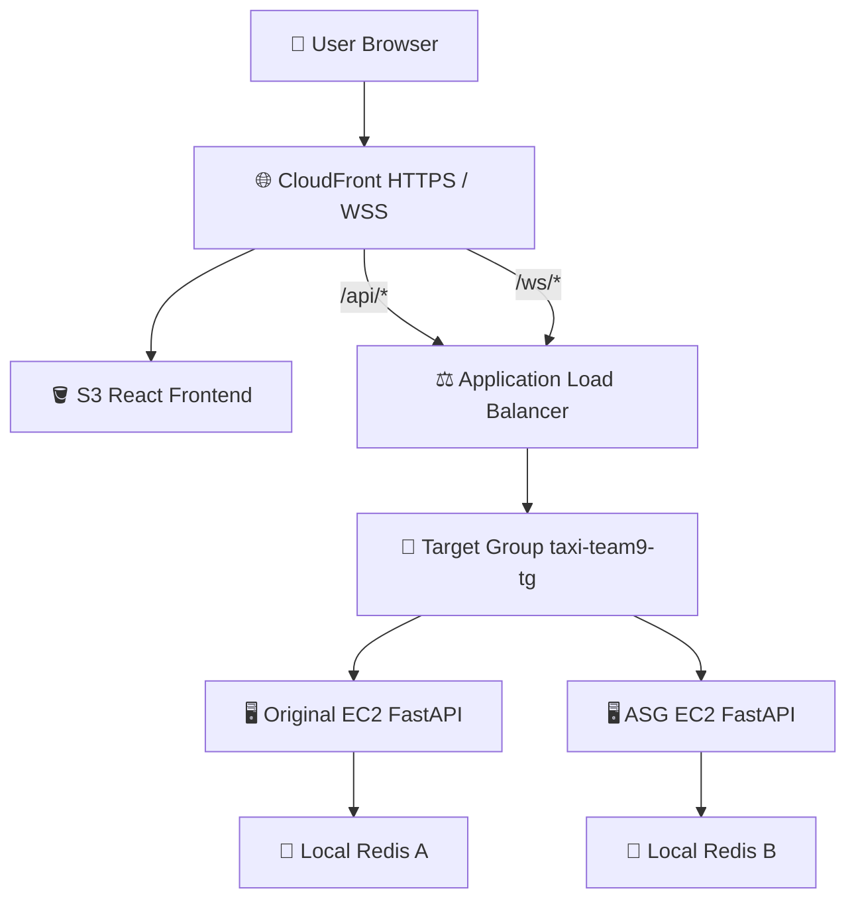
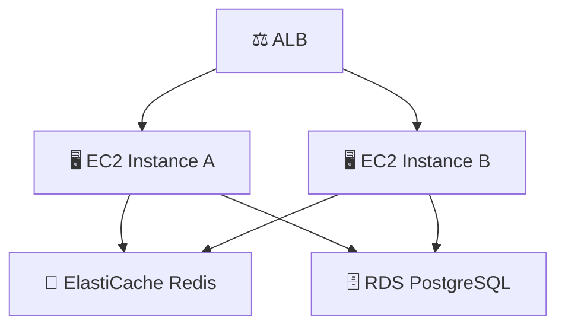

# 🚕 Taxi Mate Team9 Cloud

택시 동승 매칭 서비스 **Taxi Mate**의 AWS 클라우드 배포 및 인프라 정리 문서입니다.

📌 Detailed report: [CLOUD_PROGRESS_REPORT.md](./CLOUD_PROGRESS_REPORT.md)

---

## 🇰🇷 Korean

## 🌟 프로젝트 소개

Taxi Mate는 React/Vite 프론트엔드와 FastAPI 백엔드를 기반으로 한 실시간 택시 동승 매칭 서비스입니다.
클라우드 파트는 이 서비스를 AWS에서 실행하기 위해 프론트엔드 정적 호스팅, 백엔드 서버 운영, API/WSS 라우팅, Redis 세션 처리, Auto Scaling 구조를 구성합니다.

현재 배포는 **CloudFront + S3 + ALB + EC2 + local Redis + Auto Scaling Group** 기준으로 준비되어 있습니다.

---

## 🧭 현재 AWS 리소스

| Resource | Name / Value |
| --- | --- |
| 🌐 CloudFront | `https://d197d07kgig7vi.cloudfront.net` |
| 🪣 S3 bucket | `taxi-team9-frontend-s3` |
| ⚖️ ALB | `taxi-team9-alb-2054411194.ap-northeast-2.elb.amazonaws.com` |
| 🖥️ EC2 | `taxi-team9-ec2` |
| 🔑 EC2 public IP | `13.124.236.48` |
| 🎯 Target Group | `taxi-team9-tg` |
| 📈 Auto Scaling Group | `taxi-team9-asg` |
| 🚀 Launch Template | `taxi-team9-launch-template1` |
| 🧠 Redis | Local Redis on EC2, `127.0.0.1:6379` |

---

## 🏗️ 현재 아키텍처



### ✅ 최종 확장 구조에서 필요한 개선



현재 Auto Scaling은 생성 및 ALB 연결까지 완료되었습니다.
하지만 Redis가 각 EC2 내부 local Redis로 분리되어 있어 multi-instance 상황에서는 session inconsistency가 발생할 수 있습니다.
따라서 최종 확장 구조에서는 **ElastiCache Redis**가 필요합니다.

---

## ✅ 완료된 작업

* 🖥️ EC2 instance 생성 및 SSH 접속 문제 해결
* ⚙️ FastAPI backend를 EC2에서 실행
* 🔁 `taxi-backend.service` systemd service 설정
* 🧠 Redis 설치 및 실행
* 🔐 Redis 미실행으로 발생한 Kakao login 실패 해결
* 💚 `/health` endpoint 추가/확인 및 ALB health check 성공
* 🪣 S3 bucket에 frontend build 파일 업로드
* 🌐 CloudFront distribution 생성 및 HTTPS frontend 제공
* 🔀 CloudFront `/api/*` behavior를 ALB로 연결
* 🔌 CloudFront `/ws/*` behavior를 ALB로 연결
* 🧯 HTTPS frontend -> HTTP ALB 직접 호출로 발생한 mixed content 문제 해결
* 🧩 frontend production env를 CloudFront HTTPS/WSS 주소로 변경
* 🛠️ backend WebSocket package 문제 해결
* ✅ WebSocket이 CloudFront -> ALB -> EC2 FastAPI로 도달하는 것 확인
* 📈 Auto Scaling용 AMI, Launch Template, Auto Scaling Group 생성
* 🎯 Auto Scaling Group을 ALB target group과 연결
* 🧼 팀 변경사항 반영: 성별 제한 로직 제거, `.map()` 오류 방지, Linux import 대소문자 수정, 방 생성 빈칸 validation 추가

---

## 🧪 현재 확인된 동작

```bash
curl https://d197d07kgig7vi.cloudfront.net/api/rooms
```

현재 확인된 상태:

| Feature | Status |
| --- | --- |
| Kakao login | ✅ Working |
| Redis session on single EC2 | ✅ Working |
| CloudFront frontend | ✅ Working |
| ALB `/health` | ✅ Working |
| Room creation | ✅ Working |
| Room join API | ✅ Working |
| WebSocket/WSS routing | ✅ Accepted by backend |
| Auto Scaling Group | ✅ Created |
| Target Group | ✅ Healthy targets |

---

## ⚠️ 중요한 Auto Scaling 이슈

Auto Scaling 추가 후 두 backend instance가 동시에 target group에 연결되면 API가 가끔 `401 Unauthorized`를 반환할 수 있습니다.

원인:

```text
Original EC2 -> local Redis A
ASG EC2      -> local Redis B
```

로그인 session token이 Redis A에 저장된 뒤 다음 API 요청이 Redis B가 있는 instance로 전달되면 Redis B는 token을 알 수 없습니다.
따라서 multi-instance 안정성을 위해 최종 구조에서는 반드시 shared Redis가 필요합니다.

```text
Both EC2 instances -> same ElastiCache Redis
```

데모에서는 original EC2 중심으로 안정적으로 시연하고, Auto Scaling은 구성 완료 screenshot과 scalability 설명으로 사용하는 것이 안전합니다.

---

## 📋 남은 이슈

* 🔍 Room search feature 추가 확인 필요
* 💰 Settlement feature 추가 확인 필요
* 🗺️ Map marker 표시 안정성 확인 필요
* 👥 Join 이후 participant count 즉시 갱신 확인 필요
* 🚻 Kakao gender consent/review 문제로 gender 제한 기능은 제거 또는 optional 처리
* 🧠 Multi-instance 안정성을 위해 local Redis를 ElastiCache Redis로 교체 필요
* 🗄️ 최종 production 구조에서는 local/SQLite DB를 RDS PostgreSQL로 전환 필요

---

## 📸 최종 제출용 Screenshot Checklist

* 🖥️ EC2 instance running
* ⚙️ `taxi-backend.service` active
* 🧠 `redis-server.service` active
* 💚 ALB target group healthy
* 🌐 CloudFront distribution
* 🪣 S3 frontend files
* 🔀 CloudFront `/api/*` behavior
* 🔌 CloudFront `/ws/*` behavior
* 📈 Auto Scaling Group
* 🚀 Launch Template
* 🧪 `/api/rooms` response through CloudFront
* ✅ WebSocket accepted backend log

---

## 🇺🇸 English

## 🌟 Project Introduction

Taxi Mate is a real-time taxi ride-sharing service built with a React/Vite frontend and FastAPI backend.
The cloud part prepares AWS frontend hosting, backend operation, API/WSS routing, Redis session handling, and Auto Scaling.

The current deployment is prepared with **CloudFront + S3 + ALB + EC2 + local Redis + Auto Scaling Group**.

---

## 🧭 Current AWS Resources

| Resource | Name / Value |
| --- | --- |
| 🌐 CloudFront | `https://d197d07kgig7vi.cloudfront.net` |
| 🪣 S3 bucket | `taxi-team9-frontend-s3` |
| ⚖️ ALB | `taxi-team9-alb-2054411194.ap-northeast-2.elb.amazonaws.com` |
| 🖥️ EC2 | `taxi-team9-ec2` |
| 🔑 EC2 public IP | `13.124.236.48` |
| 🎯 Target Group | `taxi-team9-tg` |
| 📈 Auto Scaling Group | `taxi-team9-asg` |
| 🚀 Launch Template | `taxi-team9-launch-template1` |
| 🧠 Redis | Local Redis on EC2, `127.0.0.1:6379` |

---

## 🏗️ Current Architecture


### ✅ Recommended Final Scalable Architecture


Auto Scaling is created and connected to ALB.
However, Redis is still local to each EC2 instance, so session consistency is not stable in multi-instance routing.
The final scalable architecture needs **ElastiCache Redis**.

---

## ✅ Completed Work

* 🖥️ Fixed EC2 SSH access
* ⚙️ Ran FastAPI backend on EC2
* 🔁 Configured backend as `taxi-backend.service`
* 🧠 Installed and started Redis
* 🔐 Fixed Kakao login failure caused by Redis not running
* 💚 Added/confirmed `/health` endpoint and ALB health check
* 🪣 Uploaded frontend build files to S3
* 🌐 Created CloudFront distribution and served frontend through HTTPS
* 🔀 Configured CloudFront `/api/*` behavior to ALB
* 🔌 Configured CloudFront `/ws/*` behavior to ALB
* 🧯 Fixed mixed content issue from HTTPS frontend calling HTTP ALB directly
* 🧩 Updated frontend production env to CloudFront HTTPS/WSS
* 🛠️ Fixed backend WebSocket package issue
* ✅ Confirmed WebSocket reaches FastAPI through CloudFront -> ALB -> EC2
* 📈 Created AMI, Launch Template, and Auto Scaling Group
* 🎯 Connected Auto Scaling Group to the ALB target group
* 🧼 Reflected team branch changes: gender logic removed, `.map()` crash prevention, Linux import path casing fixes, empty room creation validation

---

## 🧪 Current Working Status

```bash
curl https://d197d07kgig7vi.cloudfront.net/api/rooms
```

| Feature | Status |
| --- | --- |
| Kakao login | ✅ Working |
| Redis session on single EC2 | ✅ Working |
| CloudFront frontend | ✅ Working |
| ALB `/health` | ✅ Working |
| Room creation | ✅ Working |
| Room join API | ✅ Working |
| WebSocket/WSS routing | ✅ Accepted by backend |
| Auto Scaling Group | ✅ Created |
| Target Group | ✅ Healthy targets |

---

## ⚠️ Important Auto Scaling Issue

After Auto Scaling added another backend instance, API requests can sometimes return `401 Unauthorized`.

Reason:

```text
Original EC2 -> local Redis A
ASG EC2      -> local Redis B
```

If the login session token is saved in Redis A and the next API request is routed to Redis B, Redis B cannot validate the token.
Stable multi-instance operation requires shared Redis:

```text
Both EC2 instances -> same ElastiCache Redis
```

For a stable live demo, use the original EC2 path and keep Auto Scaling screenshots for the report and scalability explanation.

---

## 📋 Remaining Issues

* 🔍 Room search feature needs confirmation
* 💰 Settlement feature needs confirmation
* 🗺️ Map marker reliability needs confirmation
* 👥 Participant count update after joining needs confirmation
* 🚻 Kakao gender restriction was removed/should remain optional because Kakao gender consent requires review
* 🧠 Multi-instance stability requires replacing local Redis with ElastiCache Redis
* 🗄️ Production architecture should migrate local/SQLite DB usage to RDS PostgreSQL

---

## 📸 Final Screenshot Checklist

* 🖥️ EC2 instance running
* ⚙️ `taxi-backend.service` active
* 🧠 `redis-server.service` active
* 💚 ALB target group healthy
* 🌐 CloudFront distribution
* 🪣 S3 frontend files
* 🔀 CloudFront `/api/*` behavior
* 🔌 CloudFront `/ws/*` behavior
* 📈 Auto Scaling Group
* 🚀 Launch Template
* 🧪 `/api/rooms` response through CloudFront
* ✅ WebSocket accepted backend log
